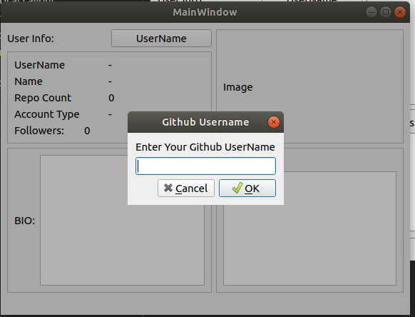
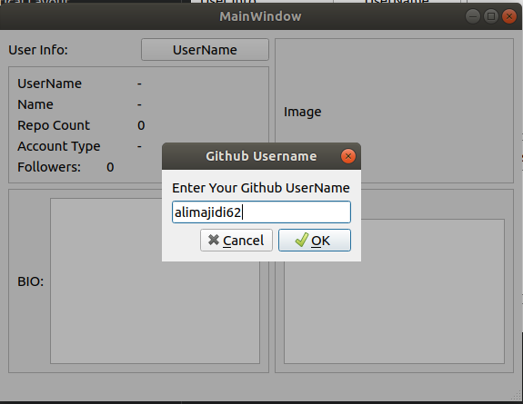
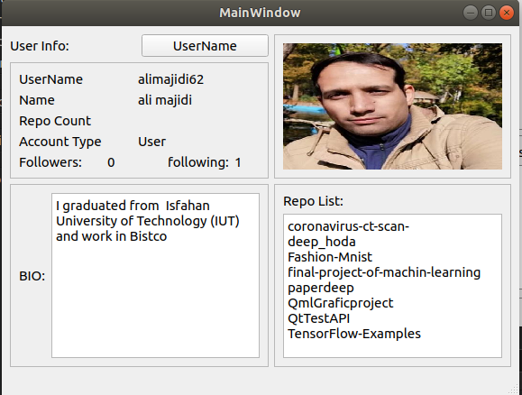

<h1>WORKING WITH REST API in QT</h1>
<h2>WHAT ARE APIs?</h2>
API is short for Application Programming Interface. You can think of it as an intermediary between computers or software systems, It provides an environment for those systems to interact with each other, Usually you have a client(your application) which requests information from the server(service) and the API determines how that entire environment will function.
<h2>How is Data passed through APIs?</h2>
The predominant form in which data is passed in an environment leveraging APIs is through JSON which stands for JavaScript Object Notation which is a light-weight text-based format used for representing structured data based on JavaScript object syntax.
<h2>REST APIs</h2>
If you've been in the software development ecosystem for even a little while, you've most likely heard of REST APIs. REST is short for Representational State Transfer which is a software architectural style. A REST API an API that follows the REST design principles. Unlike some other API models, REST APIs are flexible, user-friendly and easy to work with across multiple programming languages and it has non-strict design principles which is why it's easy to work with.

